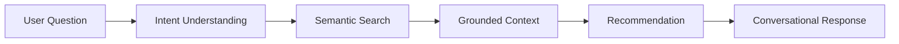
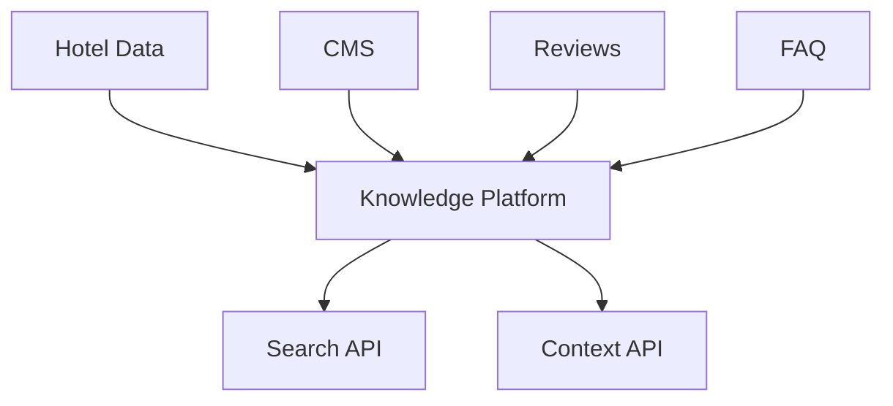
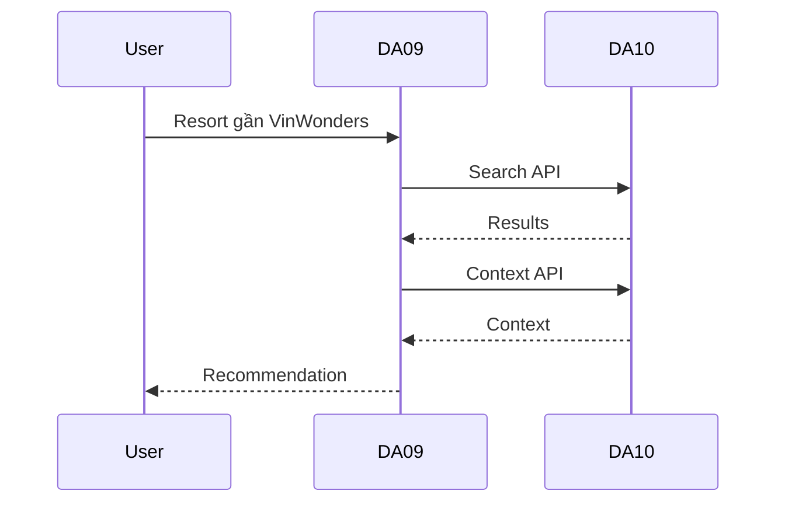

## Sơ đồ 1: DA09 Pipeline

```mermaid
graph LR
    A["User Question"] --> B["Intent Understanding"]
    B --> C["Semantic Search"]
    C --> D["Grounded Context"]
    D --> E["Recommendation"]
    E --> F["Conversational Response"]
```

## Sơ đồ 2: Knowledge Platform (DA10)

```mermaid
graph TB
    A["Hotel Data"] --> KB["Knowledge Platform"]
    B["CMS"] --> KB
    C["Reviews"] --> KB
    D["FAQ"] --> KB
    
    KB --> E["Search API"]
    KB --> F["Context API"]
```

## Sơ đồ 3: DA09 + DA10 Interaction

```mermaid
sequenceDiagram
    participant User
    participant DA09
    participant DA10

    User->>DA09: Resort gần VinWonders

    DA09->>DA10: Search API
    DA10-->>DA09: Results

    DA09->>DA10: Context API
    DA10-->>DA09: Context

    DA09-->>User: Recommendation
```
