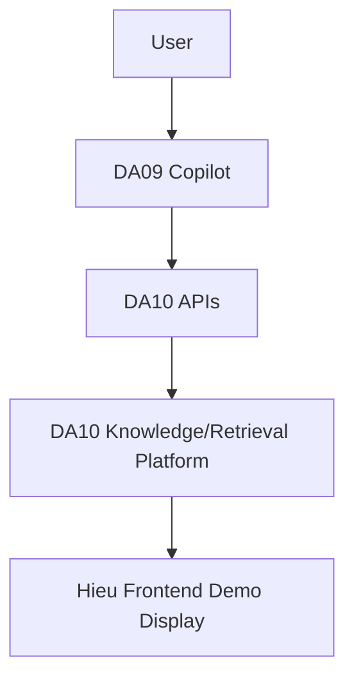
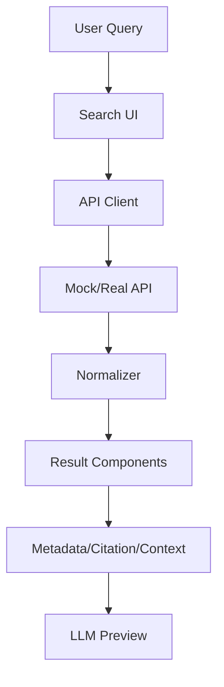
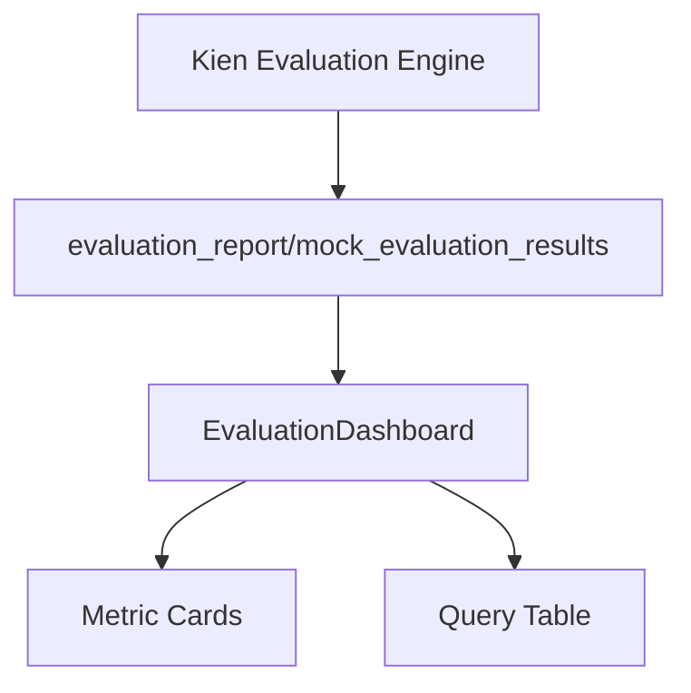

# HIEU_FRONTEND_ARCHITECTURE

# Kiến Trúc Frontend Demo Tool - Nguyễn Duy Hiếu

Người phụ trách: Nguyễn Duy Hiếu

Vai trò: Frontend Demo Tool / DA10 Demo Display Layer

Dự án: DA10 - Knowledge Platform & Retrieval Infrastructure

Cập nhật: 2026-06-05

## Mục Đích

Tài liệu này mô tả kiến trúc của Frontend Demo Tool do Nguyễn Duy Hiếu phụ trách trong bối cảnh kiến trúc DA09/DA10 mới được mentor làm rõ.

Frontend của Hiếu không phải chatbot DA09 và không phải backend retrieval DA10. Nó là lớp demo/display để trực quan hóa output của DA10 APIs:

```
User Query -> Top-K Results -> Metadata -> Citation -> Source Documents -> Context Chunks -> LLM Consumption Preview
```

Tài liệu này dùng để mentor/team hiểu:

- Frontend của Hiếu nằm ở đâu trong kiến trúc enterprise AI travel platform.
- Hiếu sở hữu phần nào và không sở hữu phần nào.
- Frontend phụ thuộc API/data nào.
- Evaluation metrics được hiển thị ra sao mà không do frontend tính toán.
- Khi API contract hoặc dashboard scope thay đổi thì cần cập nhật những gì.

## HIEU_TASK_BOARD.md vs HIEU_FRONTEND_ARCHITECTURE.md

`docs/docs_NDHieu/HIEU_TASK_BOARD.md` là task/project management board.

Nó dùng để theo dõi:

- task registry
- sprint progress
- backlog
- scope changes
- việc đang blocked
- next action của Hiếu

`docs/HIEU_FRONTEND_ARCHITECTURE.md` là architecture document.

Nó dùng để mô tả:

- vị trí của frontend trong DA09/DA10
- frontend scope boundary
- API dependency boundary
- internal frontend architecture
- evaluation display layer
- governance khi thay đổi kiến trúc/API/dashboard

Nói ngắn gọn:

- Task board trả lời: **đang làm gì, xong chưa, bị chặn ở đâu?**
- Architecture document trả lời: **hệ thống được thiết kế như thế nào và boundary nằm ở đâu?**

## Position In DA09/DA10 Architecture

Mentor đã làm rõ:

- **DA09 = Travel AI Search & Recommendation Copilot / chatbot layer.**
- **DA10 = Knowledge Platform & Retrieval Infrastructure.**
- DA09 không truy cập trực tiếp data sources.
- DA09 consume DA10 APIs.
- DA10 là lớp duy nhất truy cập knowledge repositories.
- DA10 cung cấp reusable retrieval services như Search API, Context API và Knowledge API.
- Frontend của Hiếu là DA10 Demo / Display Layer để trình bày output của DA10 APIs.

Vị trí của frontend Hiếu:

```
User
-> DA09 Travel AI Search & Recommendation Copilot
-> DA10 APIs
-> DA10 Knowledge/Retrieval Platform
-> Hieu Frontend Demo Display
-> Mentor/Team Review
```

Ý nghĩa:

- Frontend của Hiếu **không phải DA09 chatbot**.
- Frontend của Hiếu **không tạo câu trả lời chatbot**.
- Frontend của Hiếu **không truy cập data sources**.
- Frontend của Hiếu **không chạy retrieval/ranking backend**.
- Frontend của Hiếu **hiển thị output từ DA10 APIs** để chứng minh dữ liệu trả về có đủ metadata, citation, source, context và LLM-ready package.

Trong kiến trúc DA10, frontend demo nằm ở phía consumer/display, tương tự một công cụ quan sát output của Platform Services:

- Search API: trả về ranked candidates.
- Context API: trả về context package, citations, sources.
- Knowledge API: tra cứu document/metadata khi cần.
- Evaluation output: metrics/report do API & Evaluation owner cung cấp.

## Hieu Frontend Scope

### Hieu OWNS

Hiếu sở hữu các phần display và demo UX:

- Search/RAG result display.
- Metadata display.
- Citation display.
- Source document display.
- Context chunk display.
- LLM consumption preview.
- Evaluation result display.
- Demo UX.
- Loading, empty, error và missing-data states.
- Demo scenarios và mentor-facing flow.
- Standalone HTML demo khi backend hoặc React/Vite chưa sẵn sàng.
- React-ready UI components cho Sprint 2/Sprint 3.

### Hieu DOES NOT OWN

Hiếu không sở hữu:

- Data cleaning.
- Metadata extraction.
- Chunking.
- Embedding.
- Search infrastructure.
- Retrieval/ranking algorithms.
- Hybrid search implementation.
- Re-ranking algorithm.
- API backend implementation.
- Evaluation metric calculation.
- DA09 chatbot response generation.
- DA09 conversation orchestration.
- DA10 knowledge repository ownership.

Nếu frontend hiển thị `score`, `Recall@10`, `MRR@10`, `NDCG@10`, `Citation Coverage`, `Context Quality` hoặc `p95 latency`, thì đó là dữ liệu được cung cấp bởi backend/evaluation output. Frontend chỉ render, không tính toán các metric đó.

## API Dependency Boundary

Frontend phụ thuộc vào DA10 APIs và output contracts. Ranh giới này cần rõ để tránh frontend tự giả định hoặc âm thầm đổi shape dữ liệu.

| Frontend Feature | API/Data Needed | Owner | Status | Notes |
| --- | --- | --- | --- | --- |
| Search result display | Search API `POST /search`; fields: `query`, `results`, `id`, `title`, `snippet`, `score` | Vũ Đức Kiên + Nguyễn Anh Tài | Mock ready, real API pending | Hiếu render Top-K; ranking/score do retrieval/ranking backend quyết định. |
| Context chunk display | Context API `POST /context`; fields: `context_chunks`, `chunk_id`, `source_document_id`, `text`, `rank` | Vũ Đức Kiên + Nguyễn Ngọc Khánh Duy | Mock ready, real API pending | Hiếu render chunks; chunking logic không thuộc frontend. |
| Citation display | Context API/Search API citation fields: `citation_id`, `source_document_id`, `chunk_id`, `quote`, `url` | Vũ Đức Kiên | Mock ready, contract pending | Citation format cần ổn định trước Sprint 2 integration. |
| Source document display | Source document fields or Knowledge API lookup: `document_id`, `title`, `type`, `path/url`, `metadata` | Vũ Đức Kiên + Knowledge Engineering | Mock ready, Knowledge API future | Có thể dùng Knowledge API sau nếu cần mở chi tiết document. |
| Metadata display | Metadata schema: location, category, amenities, ranking info, price level, best-for tags | Trương Anh Long + Vũ Đức Kiên | Mock ready, schema pending | Frontend cần schema ổn định để tránh sửa component nhiều lần. |
| Evaluation dashboard | `evaluation_report`, `mock_evaluation_results` hoặc Evaluation API output | Vũ Đức Kiên | Not ready | Hiếu hiển thị metrics; Kiên tính metrics. |
| LLM consumption preview | Context API output: LLM-ready context package, citations, sources, metadata | Vũ Đức Kiên | Mock ready, final shape pending | Đây là phần chứng minh DA10 output có thể cấp cho DA09/LLM. |

## Evaluation Display Layer

Vũ Đức Kiên sở hữu API & Evaluation. Vì vậy evaluation architecture phải được hiểu như sau:

```
Evaluation Engine by Kien
-> evaluation_report / metrics JSON / API output
-> Hieu Frontend Evaluation Display
-> Metric Cards / Query Table / Demo Dashboard
```

Hiếu không tính evaluation metrics.

Hiếu chỉ consume và display:

- `evaluation_report`
- `mock_evaluation_results`
- metrics JSON
- hoặc Evaluation API output nếu team bổ sung endpoint sau này

Metrics có thể hiển thị:

- Recall@10
- MRR@10
- NDCG@10
- Citation Coverage
- Context Quality
- p95 latency

Quy tắc hiển thị:

- Nếu Kiên chưa cung cấp output thật, mọi evaluation value phải được label là `mock`, `demo`, hoặc `placeholder`.
- Không được trình bày mock metrics như metrics thật.
- Dashboard cần phân biệt rõ:
    - retrieval quality metrics
    - RAG/citation/context metrics
    - system performance metrics
- Nếu metric definition thay đổi, frontend chỉ cập nhật label/format/display theo output mới; công thức tính vẫn thuộc Evaluation owner.

## Architecture Change Governance

Không thay đổi frontend architecture một cách âm thầm.

Quy tắc bắt buộc:

- Bất kỳ API contract change nào phải được raise cho team trước khi frontend thay đổi.
- Bất kỳ response shape change nào phải cập nhật:
    - `frontend/src/api/api_client.js`
    - `frontend/src/types/searchTypes.js`
    - `frontend/mock_api_responses.json`
    - `docs/HIEU_FRONTEND_ARCHITECTURE.md`
- Nếu standalone HTML vẫn nhúng mock data, response shape change cũng phải kiểm tra/cập nhật:
    - `frontend/search_ui.html`
- Bất kỳ evaluation output format change nào phải cập nhật:
    - `EvaluationDashboard` hoặc dashboard component tương ứng
    - mock evaluation data nếu có
    - `docs/HIEU_FRONTEND_ARCHITECTURE.md`
- Bất kỳ dashboard scope change nào phải cập nhật:
    - `docs/docs_NDHieu/HIEU_TASK_BOARD.md`
- Bất kỳ DA09/mentor requirement change nào phải được log trong `HIEU_TASK_BOARD.md` dưới mục `New Requests / Scope Changes`.
- Nếu thêm React/Vite runtime, phải cập nhật README, task board và architecture doc.
- Nếu thêm Knowledge API usage, phải cập nhật API Dependency Boundary.
- No silent architecture changes.

## Current Architecture

Hiện tại có hai phần:

1. Standalone HTML demo.
2. React-ready modules.

Standalone HTML demo:

```
frontend/search_ui.html
```

Vai trò:

- Demo Search/RAG flow ngay cả khi backend chưa sẵn sàng.
- Dùng embedded mock data để tránh lỗi fetch local JSON.
- Cho mentor xem output format kỳ vọng của DA10 APIs.

Mock API source:

```
frontend/mock_api_responses.json
```

Vai trò:

- Mô phỏng Search API.
- Mô phỏng Context API.
- Cung cấp 3 OTA demo queries.
- Ghi lại shape frontend đang kỳ vọng.

Rendered sections:

- Search UI.
- Top-K Results.
- Metadata.
- Citations.
- Source Documents.
- Context Chunks.
- LLM Consumption Preview.
- Loading/empty/error states.
- Missing citation/context/source fallback.

## Target Architecture

Target frontend architecture:

```
SearchInterface.jsx
-> api_client.js
-> config.js
-> Mock API or Real DA10 APIs
-> Normalizer
-> ResultList.jsx
-> ResultCard.jsx
-> MetadataCard.jsx
-> CitationList.jsx
-> ContextPreview.jsx
-> LLM Consumption Preview
-> EvaluationDashboard when evaluation output is available
```

Target API mode:

- Mock mode: local JSON data.
- Real mode: DA10 APIs.

Target DA10 API endpoints:

```
POST /search
POST /context
GET /documents/{id} or Knowledge API later if needed
```

## Mermaid Diagrams

### A. DA09/DA10 Position Diagram



### B. Hieu Frontend Internal Architecture



### C. Evaluation Display Architecture



## Sprint 1 Architecture

Sprint 1 tập trung vào research, design và prototype.

Đã hoàn thành:

- Standalone Search/RAG demo.
- Mock Search API/Context API responses.
- Demo scenarios.
- Dashboard design.
- Frontend architecture design.
- Mentor Q&A.
- Mock data explanation.

Sprint 1 architecture value:

- Có demo chạy được dù DA10 backend chưa sẵn sàng.
- Chứng minh output DA10 nên được hiển thị như thế nào.
- Tạo mock contract ban đầu cho Sprint 2.
- Làm rõ frontend là display layer, không phải retrieval layer.

## Sprint 2 Architecture

Sprint 2 cần chuyển prototype thành kiến trúc frontend module hóa.

Đã chuẩn bị một phần:

```
frontend/src/components/SearchInterface.jsx
frontend/src/components/ResultList.jsx
frontend/src/components/ResultCard.jsx
frontend/src/components/MetadataCard.jsx
frontend/src/components/CitationList.jsx
frontend/src/components/ContextPreview.jsx
frontend/src/components/LoadingState.jsx
frontend/src/components/ErrorState.jsx
frontend/src/components/EmptyState.jsx
frontend/src/api/api_client.js
frontend/src/config/config.js
frontend/src/types/searchTypes.js
frontend/src/dashboard/Dashboard.jsx
```

Cần quyết định/xây thêm:

- React/Vite runtime hay tiếp tục standalone HTML.
- App entry point nếu dùng React.
- Final `/search` response mapping.
- Final `/context` response mapping.
- Evaluation output display format.
- Component smoke test.
- Mock/real API switch verification.

Sprint 2 dependency lớn nhất:

- `api_contract.yaml` từ Kiên/API team.

## Sprint 3 Architecture

Sprint 3 là giai đoạn integration, evaluation display, UX review và final demo.

Target:

- Final dashboard.
- Real API integration.
- Evaluation metrics display.
- E2E test.
- UX report.
- Final demo flow.

Nếu backend chưa sẵn sàng:

- `search_ui.html` vẫn là fallback demo.
- Evaluation metrics phải dùng mock/demo label.
- Không claim real evaluation.

## Dependency Map

| Frontend Component | Depends On | Owner | Status |
| --- | --- | --- | --- |
| `search_ui.html` | Demo scenarios, embedded mock data | Nguyễn Duy Hiếu | DONE |
| `mock_api_responses.json` | Expected Search/Context response shape | Nguyễn Duy Hiếu + Vũ Đức Kiên input | DONE/mock |
| `SearchInterface.jsx` | Query behavior, API client | Nguyễn Duy Hiếu | IN_PROGRESS |
| `api_client.js` | `config.js`, `api_contract.yaml`, backend endpoints | Nguyễn Duy Hiếu + Vũ Đức Kiên | IN_PROGRESS |
| `config.js` | API base URL, mock/real mode | Nguyễn Duy Hiếu | IN_PROGRESS |
| `searchTypes.js` | Final response shape | Nguyễn Duy Hiếu + Vũ Đức Kiên | IN_PROGRESS |
| `ResultList.jsx` | Normalized SearchResponse | Nguyễn Duy Hiếu | IN_PROGRESS |
| `ResultCard.jsx` | Normalized SearchResult | Nguyễn Duy Hiếu | IN_PROGRESS |
| `MetadataCard.jsx` | Metadata schema | Nguyễn Duy Hiếu + Trương Anh Long | IN_PROGRESS |
| `CitationList.jsx` | Citation/source response shape | Nguyễn Duy Hiếu + Vũ Đức Kiên | IN_PROGRESS |
| `ContextPreview.jsx` | Context chunk response shape | Nguyễn Duy Hiếu + Nguyễn Ngọc Khánh Duy + Vũ Đức Kiên | IN_PROGRESS |
| LLM Consumption Preview | Context API LLM-ready package | Nguyễn Duy Hiếu displays, Vũ Đức Kiên provides | IN_PROGRESS/mock |
| EvaluationDashboard | Evaluation report/metrics output | Nguyễn Duy Hiếu displays, Vũ Đức Kiên calculates | TODO |
| Real Search API integration | `POST /search` | Vũ Đức Kiên + Nguyễn Anh Tài + Lê Hoàng Đạt | BLOCKED |
| Real Context API integration | `POST /context` | Vũ Đức Kiên + Nguyễn Ngọc Khánh Duy | BLOCKED |
| Knowledge API integration | document/metadata lookup | Vũ Đức Kiên + Knowledge Engineering | FUTURE |

## Next Architecture Decisions Before Sprint 2

Cần quyết định trước khi Sprint 2 đi sâu vào implementation:

- React/Vite or standalone HTML?
- Final `/search` response shape?
- Final `/context` response shape?
- Evaluation output format?
- Dashboard consumes JSON report or API endpoint?
- Should mock data be deduplicated between HTML and JSON?
- Knowledge API có nằm trong Sprint 2 không, hay để Sprint 3/future?
- Mock API server có cần không, hay local mock JSON đủ cho Sprint 2?

## Next Actions For Hieu

Hiếu có thể làm ngay:

- Review trực quan `frontend/search_ui.html` trên laptop/màn chiếu.
- Chạy 3 demo query với mentor/team.
- Cập nhật `frontend/ux_report.md` sau feedback.
- Kiểm tra drift giữa HTML embedded mock data và `mock_api_responses.json`.
- Chuẩn bị mock evaluation display nhưng label rõ là mock/demo.
- Soát lại architecture boundary trước khi trình bày để không claim nhầm ownership.

Hiếu phải chờ:

- `api_contract.yaml`.
- Search API thật.
- Context API thật.
- Evaluation output format từ Kiên.
- React/Vite team decision.
- Golden/evaluation dataset chính thức.

## Tóm Tắt

Frontend của Nguyễn Duy Hiếu là DA10 Demo / Display Layer. Nó trực quan hóa output từ DA10 APIs để mentor/team kiểm tra Search/RAG traceability. Nó không phải DA09 chatbot, không phải DA10 backend retrieval infrastructure và không tính evaluation metrics.

Ranh giới quan trọng nhất:

- Kiên/API team cung cấp API contract, Search API, Context API và evaluation output.
- Hiếu hiển thị các output đó trong Search/RAG UI và dashboard.
- Mọi thay đổi về API response, evaluation format hoặc DA09/mentor requirement phải được ghi nhận và cập nhật tài liệu liên quan.