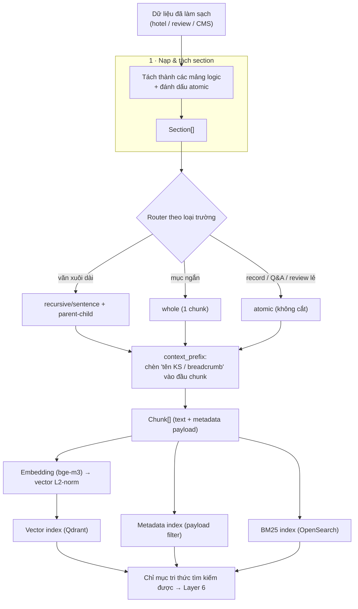

# Nguyễn Ngọc Khánh Duy (embedding & chunking)

# Bản Thiết Kế Kiến Trúc Chunking & Embedding

Người phụ trách: Nguyễn Ngọc Khánh Duy
Vai trò: Chunking & Embedding (Layer 3–4)
Dự án: DA10 — OTA AI Search Platform

## Mục Đích

Tài liệu này mô tả kiến trúc khâu **Chunking** (chia nhỏ tri thức) và **Embedding**
(sinh vector) — biến dữ liệu khách sạn/đánh giá/cẩm nang đã làm sạch thành **chỉ mục
tri thức tìm kiếm được**. Đây là đầu vào cho khâu Retrieval & Ranking (Layer 6).

Tài liệu trả lời:

- Dữ liệu nào được chunk + embed, dữ liệu nào chỉ vào metadata index?
- Mỗi loại dữ liệu chunk theo chiến lược nào?
- Chọn model embedding nào và vì sao?

---

## 1. KIẾN TRÚC LÕI PIPELINE

Nguyên tắc xuyên suốt: **một router định tuyến chiến lược chunk theo loại dữ liệu**
(hybrid), KHÔNG dùng một kiểu cho tất cả. Mọi chunk đều bật `context_prefix` và mang
metadata payload.

---

## 2. PHÂN LOẠI DỮ LIỆU: EMBED vs METADATA

Quy tắc một câu: *văn bản con người đọc/diễn đạt nhiều cách → chunk + embed; giá trị
máy so sánh (số / đúng-sai / enum) → metadata index.*

### 2.1 Được chunk + embed

| Đơn vị | Chiến lược | Atomic | ~Token |
| --- | --- | --- | --- |
| description_full (mô tả dài) | recursive/sentence + parent-child | ✗ | ~300 child |
| description_short / overview / highlights | whole | ✓ | 60–120 |
| từng room_type | atomic | ✓ | ~80 |
| từng cặp FAQ | atomic | ✓ | ~80 |
| review summary (ưu/nhược) | whole | ✓ | ~150 |
| từng review lẻ | atomic | ✓ | ~50 |
| semantic profile (render concept) | whole (tùy chọn) | ✓ | ~50 |
| CMS / cẩm nang | recursive theo heading + parent-child | ✗ | ~300–512 child |

### 2.2 KHÔNG embed → metadata index

| Trường | Lý do |
| --- | --- |
| star_rating, price, review_score (số) | so sánh số → lọc |
| city, area, accommodation_type (enum) | lọc chính xác |
| cờ tiện nghi (private_beach, pool, spa…) | boolean → filter (dense chỉ ~0.05) |
| check_in, số phòng, phí (policy/operation) | QA fact → tra thẳng |
| tọa độ, distance_km | geo filter |
| image URLs, has_* | metadata UI |
| evidence, data quality | nội bộ |

---

## 3. CHIẾN LƯỢC CHUNK THEO LOẠI DỮ LIỆU

### 3.1 Khách sạn (cấu trúc)

- Mục ngắn (overview, tiện nghi, highlights) → **whole**.
- `description_full` → **recursive/sentence ~300 token** (trường DUY NHẤT cần băm).
- room, FAQ → **atomic**.

### 3.2 Review (đánh giá) — 2 tầng

- **Summary 1 chunk/KS** (whole): tổng hợp ưu/nhược + vài comment tiêu biểu.
- **Review lẻ** (atomic): không cắt (vốn ngắn).
- Bắt buộc: `context_prefix` “tên KS — Đánh giá”, **khử trùng lặp** (MinHash), metadata
`sentiment / aspect / date / guest_type / lang`.

### 3.3 CMS / Cẩm nang — recursive theo heading

- Băm theo cấu trúc heading (H1–H3), **không cắt ngang mục**, child ~300–512 token.
- **parent-child**: child để truy xuất, parent (cả mục) để trả ngữ cảnh (Layer 7).
- `context_prefix` = breadcrumb heading; metadata: tiêu đề, ngày đăng, tag, vùng, URL.

> Lưu ý quan trọng: băm nhỏ **dở** với dữ liệu khách sạn (ngắn, đồng nhất) nhưng **đúng**
với CMS (dài, đa chủ đề). ⇒ chiến lược chunk phụ thuộc loại dữ liệu.
> 

---

## 4. CONTEXT_PREFIX

Chèn breadcrumb “{tên KS / tiêu đề bài} — {mục}.” vào ĐẦU text mỗi chunk trước khi embed.

Lý do: nhiều mục là **danh sách trần không chứa định danh** → embedding không biết chunk
thuộc thực thể nào. Đo được: nhóm `activities`/`nearby` tăng từ **0.000 → 1.000** sau khi
bật. Đây là bản nhẹ của *contextual retrieval*, rẻ và hiệu quả; định danh nằm ở đầu nên
kể cả model context ngắn (PhoBERT cắt 256) vẫn giữ được phần quan trọng.

---

## 5. MODEL EMBEDDING — CHỌN `bge-m3`

So sánh 3 model trên corpus thật (chi tiết ở `embedding_report.md`):

| Model | H-Rec@10 | MRR@10 | nDCG@10 | Không dấu (MRR) | Điểm tổng |
| --- | --- | --- | --- | --- | --- |
| **bge-m3** | 0.692 | **0.770** | **0.624** | **1.000** | **0.93** |
| multilingual-e5 | **0.744** | 0.636 | 0.527 | 0.389 | 0.75 |
| vietnamese-embedding | 0.571 | 0.520 | 0.402 | 0.083 | 0.55 |

Kết luận: **bge-m3 làm model chính** — xếp hạng tốt nhất (MRR/nDCG), **bền nhất với gõ
không dấu** (yếu tố sống còn cho tiếng Việt), 8192 token context, dense + sparse, reranker
đồng bộ `bge-reranker-v2-m3`. e5 làm dự phòng (recall cao + cần rerank); vietnamese-embedding
bị loại khỏi vai trò chính (sập khi không dấu).

Cấu hình tiền xử lý bắt buộc (tính công bằng): bge-m3 (thô) · PhoBERT (tách từ, ctx 256) ·
e5 (prefix `query:`/`passage:`, ctx 512).

---

## 6. BA ENGINE TÌM KIẾM

| Engine | Lo điều kiện | Ví dụ |
| --- | --- | --- |
| **Metadata index** | chính xác / khoảng / boolean / enum | `star=5 ∧ private_beach=true` |
| **BM25** | từ khóa / tên riêng | “Landmark 81”, “bãi biển riêng” |
| **Vector (bge-m3)** | ý nghĩa / ý định / không dấu | “nơi lãng mạn yên tĩnh” |

Khâu Chunking & Embedding chịu trách nhiệm cấp **vector chất lượng** (nhánh Vector) và
**metadata payload sạch** (nhánh Metadata); text chuẩn hóa nuôi BM25. Việc *ghép* 3 nhánh
(RRF + rerank) là của Layer 6.

**Contract indexing (Layer 4 → Search Infra):**

- BM25 target: OpenSearch 2.11.1 @ `:9200`
- Index alias truy vấn: `hotel_chunks` (physical: `idx_hotel_chunks_v1.0`)
- Field index chính: `embed_text` (contextual BM25), metadata → payload filter
- Orchestrator: `scripts/run_index.py` (xem doc Search Infra — Lê Hoàng Đạt)

---

## 7. ĐÁNH GIÁ & BENCHMARK

- **Gold set**: 30 truy vấn tiếng Việt, nhãn suy ra từ facts (khách quan), có câu gõ không dấu.
- **Metric ưu tiên**: Hit@10, Hotel-Recall@10, MRR@10, nDCG@10. Tránh Recall@k mức-chunk
(bị trần thấp ở truy vấn nhiều đáp án).
- **Kết quả chunking**: `whole_section + context_prefix` thắng tổng thể; băm nhỏ phản tác dụng;
amenities yếu là giới hạn của dense → cần hybrid ở Layer 6.
- **Độ tin cậy**: 30 câu → sai số ≈ ±0.08; khác biệt < 0.1 coi là hoà. Cần nâng gold set
~150 câu + corpus đa dạng để số liệu chắc hơn.

---

## Tóm Tắt

- **Chỉ embed văn bản tự do**; số/boolean/enum → metadata index.
- **Chiến lược chunk theo loại dữ liệu** (hybrid): hotel mục ngắn → whole, description → recursive,
room/FAQ/review → atomic, CMS → recursive theo heading + parent-child.
- **context_prefix bắt buộc** — đòn bẩy lớn nhất.
- **Model: bge-m3** (xếp hạng tốt nhất + bền không dấu + lợi thế vận hành).