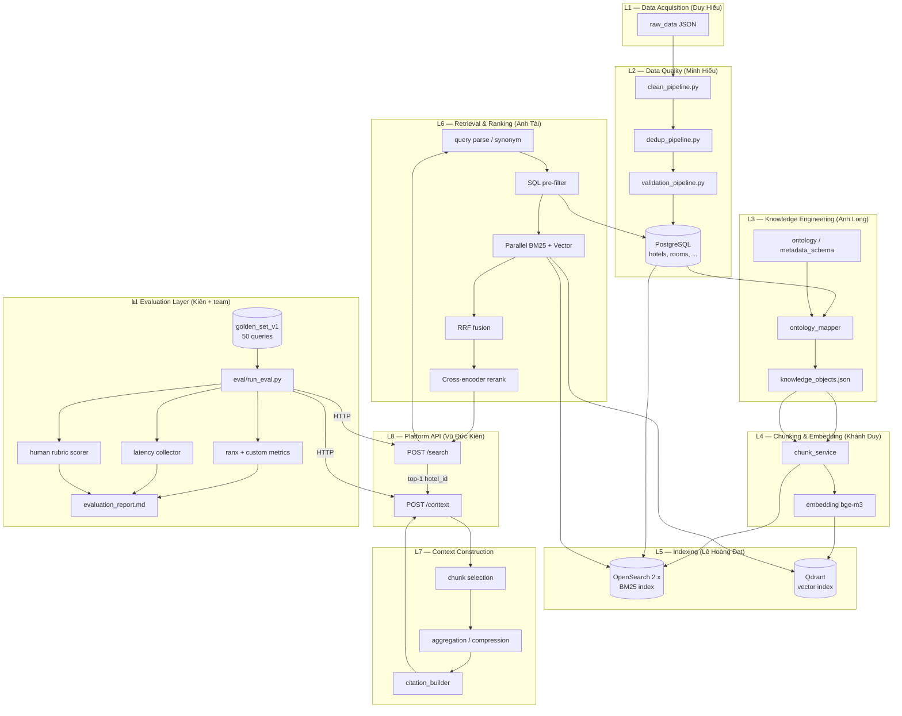

# evaluation_plan

# DA10 — Evaluation Plan

**Owner:** Vũ Đức Kiên (API & Evaluation)

**Phiên bản:** v1.0

**Phạm vi:** Đánh giá **Search API** + **Context API** trên golden set 50 query — Sprint 2 walking skeleton → Sprint 3 demo chính thức.

> Liên quan: `docs/VuDucKien_api_schema_proposal.md` (API contract chính thức), `docs/09_evaluation.md`, `observability/monitoring_plan.md`, `PHANCONG/PHANCONG1.txt`
> 

---

## 1. Mục tiêu

1. Đo chất lượng truy xuất/xếp hạng (hotel + chunk) so với golden set.
2. Đo latency p95 tại endpoint `/search` và `/context`.
3. Đo chất lượng ngữ cảnh giải thích recommend (human rubric).
4. So sánh **hybrid (production)** với **BM25-only baseline** và ablation variants (nếu còn thời gian).
5. Mọi báo cáo **tái lập được** qua dataset version + index version + git commit.

---

## 2. Phạm vi đánh giá

| Thành phần | Trong scope | Ghi chú |
| --- | --- | --- |
| Search API (`POST /search`) | ✅ | Ranking hotel-level; metric @10 với `top_k=10` |
| Context API (`POST /context`) | ✅ | Chunk-level + human rubric; gọi sau Search (top-1) |
| Knowledge API | ❌ | Chỉ dùng gián tiếp khi debug |
| Per-stage latency | ✅ (monitoring) | Chi tiết: `observability/monitoring_plan.md` §6.2 — instrument: Đạt + Anh Tài |
| Load test / QPS | ❌ | Out of scope Sprint 3 |

**Môi trường metric chính:** Sprint 3, **data + index versioned** — không dùng mock data cho báo cáo chính thức.

**Định nghĩa API (tóm tắt):**

- **Search API:** trả danh sách top-K ứng viên đã xếp hạng (production mặc định `top_k=10`; eval cũng dùng `top_k=10`).
- **Context API:** trả **Context Package** (chunks đã chọn lọc và nén kèm citation + metadata object + token info tuỳ chọn) để DA09 dùng sinh câu trả lời. `chunks[]` là core output (default trả về). DA10 = Retrieve, Ground, Provide Context — không sinh giải thích.

---

## 3. Golden Set

| Thuộc tính | Giá trị |
| --- | --- |
| Số query | **50** |
| Ngôn ngữ | Tiếng Việt (bao gồm câu không dấu) |
| Nhãn | `relevant_hotel_ids[]` + `relevant_chunk_ids[]` |
| Gán nhãn | Long (~15), Anh Tài (~15), Kiên (~20) |
| File đích | `evaluation/relevance_labels/golden_set_v1.xlsx` (export JSON cho script) |

**Quy ước nhãn:**

- **Hotel relevance:** khách sạn đúng ý query (có thể nhiều hotel/query).
- **Chunk relevance:** chunk chứa bằng chứng/text hỗ trợ recommend (có thể nhiều chunk/query, span nhiều hotel).

**Schema cột tối thiểu:**

| Cột | Kiểu | Mô tả |
| --- | --- | --- |
| `query_id` | string | ID duy nhất |
| `query` | string | Câu truy vấn tiếng Việt |
| `relevant_hotel_ids` | list[integer] | `hotels.id` — ID khách sạn ground truth |
| `relevant_chunk_ids` | list[string] | Theo pattern §3.1; gán nhãn sau khi index v1 có chunk |
| `labeler` | string | Long / Tài / Kiên |
| `notes` | string | Tuỳ chọn |

### 3.1 Quy ước `chunk_id` (canonical)

**Pattern:** `chunk-{hotel_id}-{source_code}-{seq:03d}`

| `source_type` (API) | `source_code` | Nguồn dữ liệu |
| --- | --- | --- |
| `hotel_description` | `desc` | `hotels.description` |
| `room_info` | `room-{rooms.id}` | VD: `chunk-542-room-12-001` |
| `amenity` | `amen` | `hotels.amenities` |
| `nearby` | `near-{nearby_places.id}` | VD: `chunk-805030-near-3-001` |
| `activity` | `act-{activities.id}` | VD: `chunk-805030-act-7-001` |

**Ví dụ:** `chunk-542-desc-001`, `chunk-542-room-12-002`, `chunk-805030-amen-001`

**Quy tắc sinh ID (owner Khánh Duy):**

1. Lưu làm PK cột `text_chunks.id` — đồng bộ OpenSearch + Qdrant payload + API `citations[].chunk_id`.
2. **Deterministic:** cùng `(hotel_id, source_table, source_column, record_id, chunk_index)` → cùng `chunk_id` sau re-index (trừ khi đổi chunking policy → bump index version).

---

## 4. Kiến trúc pipeline & vị trí Evaluation

Sơ đồ end-to-end tích hợp mọi module + **điểm đo eval** (ký hiệu 📊).



**Chú thích điểm đo:**

| Vị trí | Loại eval |
| --- | --- |
| 📊 `run_eval.py` → `/search` | Hotel Recall@10, MRR@10, NDCG@10, Hit@5/10, Zero-result, Hotel-Recall@10 |
| 📊 `run_eval.py` → `/context` | Chunk overlap/recall vs `relevant_chunk_ids`, citation coverage |
| 📊 Latency collector | p95 `/search`, p95 `/context` (~150 samples/run) |
| 📊 Human rubric | Context quality ≥ 4.0/5 |
| 📊 Ablation configs | BM25-only (baseline), vector-only, hybrid-no-rerank, full hybrid |

**Stack eval chính thức:** OpenSearch 2.x (BM25) + Qdrant (vector). Neo4j **OUT OF SCOPE** — pre-filter chỉ qua PostgreSQL.

---

## 5. Cấu hình eval & reproducibility

Mỗi lần chạy **full eval** ghi header trong `evaluation/reports/evaluation_report.md`:

```yaml
eval_run_id: eval_2026-06-04_001
git_commit: <hash>
dataset_version: hotels_v1 / clean_v1
index_opensearch: idx_hotel_chunks_v1.0
index_qdrant: col_documents_v1.0
embedding_model: bge-m3
search_mode: hybrid | bm25_only | vector_only | hybrid_no_rerank
top_k:10
golden_set: golden_set_v1 (50 queries)
```

**Quy tắc versioning:**

| Thay đổi | Hành động | Owner |
| --- | --- | --- |
| Data / chunking / embedding | Tăng index version, chạy eval lại từ đầu | Đạt + Khánh Duy |
| Tag index trước eval chính thức | `idx_hotel_chunks_vX` (alias `hotel_chunks`), `col_documents_vX` | Đạt |
| So sánh metric | **Chỉ trong cùng version** — không cross-version | Kiên |

**Artifact output:**

```
evaluation/
├── evaluation_plan.md          ← file này
├── relevance_labels/
│   └── golden_set_v1.xlsx
├── test_queries/
│   └── smoke_queries.json      ← 5 query cho PR smoke
├── run_eval.py                 ← TODO Sprint 2
├── metrics/
│   └── eval_<run_id>.json
├── reports/
│   └── evaluation_report.md
└── rubric_scores_v1.xlsx       ← human scoring
```

---

## 6. Metrics

### 6.1 Search API (hotel-level, `top_k=10`)

| Metric | Mục tiêu | Công thức / ghi chú |
| --- | --- | --- |
| **Recall@10** | ≥ 0.80 | |relevant hotels ∩ top10| / |relevant hotels| |
| **MRR@10** | ≥ 0.70 | Mean reciprocal rank of **first relevant hotel** |
| **NDCG@10** | ≥ 0.75 | Binary relevance: in / not in `relevant_hotel_ids` |
| **Hit@5** | Báo cáo | ≥1 relevant hotel in top 5 (cùng response `top_k=10`) |
| **Hit@10** | Báo cáo (phụ) | ≥1 relevant hotel in top 10 |
| **Hotel-Recall@10** | Báo cáo (phụ) | Đồng bộ định nghĩa với Khánh Duy (chunking benchmark) |
| **Zero Result Rate** | < 5% | Queries với `results.length == 0` (tối đa 2/50) |

> **Lưu ý `top_k`:** Production Search mặc định `top_k=10` (theo API schema). Full eval cũng gọi `top_k=10` để đo Recall/MRR/NDCG@10. Hit@5 lấy từ 5 kết quả đầu của cùng response.
> 

### 6.2 Context API (chunk-level, top-1 hotel/query)

| Metric | Mục tiêu | Ghi chú |
| --- | --- | --- |
| **Chunk Recall@K** | Báo cáo | |relevant chunks ∩ returned chunks| / |relevant chunks| |
| **Citation Coverage** | Báo cáo | % relevant chunks có citation trỏ đúng `chunk_id` |
| **Context Quality (Human)** | ≥ 4.0 / 5 | Rubric §6.4 |

**Quy trình hai bước mỗi query:**

1. `POST /search` `{ "query": "...", "top_k": 10 }` → đo hotel metrics trên full ranked list.
2. `POST /context` `{ "hotel_id": <results[0].hotel_id>, "query": "...", "query_id": "<search_response.query_id>" }` → đo chunk metrics + human rubric.

### 6.3 Latency (endpoint-level, Sprint 2–3)

| Metric | Mục tiêu | Phương pháp |
| --- | --- | --- |
| **p95 Search Latency** | < 500 ms | §7 — đo tại API, không breakdown stage |
| **p95 Context Latency** | < 500 ms | §7 |

Per-stage logging (parse → OpenSearch → Qdrant → RRF → rerank → context build): **TBD** — owner Đạt + Anh Tài.

### 6.4 Human Rubric (Context Quality)

Thang **1–5** mỗi query. Ưu tiên chấm **full 50**; nếu không kịp — tối thiểu **20% (10 query)** với 2 người chấm.

| Tiêu chí | Trọng số |
| --- | --- |
| Chunks/evidence phủ đúng khía cạnh query hỏi (không đánh giá "giải thích" — đó là DA09) | 30% |
| Bằng chứng khớp chunk/citation | 30% |
| Metadata hỗ trợ (location, amenities, concepts) | 20% |
| Rõ ràng, không bịa thông tin | 20% |

**Owner chấm:** Kiên (lead) + 1 reviewer (Long hoặc Anh Tài).

---

## 7. Baseline, Ablation & Regression

### 7.1 Baseline bắt buộc (Sprint 3)

| Mode | Mô tả | Owner chạy config | Owner chạy eval |
| --- | --- | --- | --- |
| **bm25_only** | Chỉ OpenSearch BM25 | Anh Tài | Kiên |

### 7.2 Ablation (nếu còn thời gian)

| Mode | Tắt gì | Owner config |
| --- | --- | --- |
| vector_only | BM25 | Anh Tài |
| hybrid_no_rerank | Cross-encoder rerank | Anh Tài |
| no_synonym | Synonym / query expansion | Long (rules) + Anh Tài (toggle) |
| full_hybrid | — | Production target |

### 7.3 Regression policy

- **Sprint 3 báo cáo chính thức:** `full_hybrid` phải **≥ bm25_only** trên Recall@10, MRR@10, NDCG@10. Nếu thấp hơn → không demo trừ khi nhóm ghi lý do được chấp thuận trong report.
- **Mỗi PR (smoke):** 5 query cố định — API không crash, response schema hợp lệ; không yêu cầu beat BM25 trên WIP.

---

## 8. Công nghệ Evaluation

| Mục đích | Công nghệ | Ghi chú |
| --- | --- | --- |
| Metric IR (Recall, MRR, NDCG) | **ranx** hoặc **pytrec_eval** | ranx khớp Ontology doc |
| HTTP gọi API | **httpx** | Đo latency end-to-end |
| Golden set I/O | **pandas** + **openpyxl** | Đọc xlsx, export json |
| Latency p95 | **numpy** | percentile trên samples |
| Báo cáo | Markdown template | `evaluation/reports/evaluation_report.md` |
| Version / commit | **gitpython** hoặc subprocess | Ghi commit hash tự động |
| Human rubric | **xlsx** / Google Sheet | `evaluation/rubric_scores_v1.xlsx` |
| CI smoke (tuỳ chọn) | GitHub Actions | 5 query, không block nếu index chưa sẵn Sprint 2 |

**Dependencies đề xuất** (`evaluation/requirements-eval.txt`):

```
ranx>=0.3.16
httpx>=0.27
pandas>=2.0
numpy>=1.26
pyyaml>=6.0
openpyxl>=3.1
gitpython>=3.1
```

---

## 9. Quy trình chạy (`evaluation/run_eval.py`)

> Script chưa có — owner Kiên, Sprint 2 tuần 2.
> 

### 9.1 Full eval (Sprint 2 cuối, Sprint 3 chính thức)

```bash
# Prerequisites: docker compose up, index tagged, API running
python evaluation/run_eval.py \
  --golden-set evaluation/relevance_labels/golden_set_v1.json \
  --api-base http://localhost:8000 \
  --mode full_hybrid \
  --top-k 10 \
  --latency-runs 3 \
  --output evaluation/reports/evaluation_report.md
```

**Latency protocol:**

1. **Warmup:** 10 query đầu — không tính vào metric latency.
2. **50 golden queries × 3 lần** — thu ~150 samples/endpoint.
3. Tính **p95** trên toàn bộ samples (sequential, local).

### 9.2 Smoke eval (mỗi PR)

```bash
python evaluation/run_eval.py \
  --golden-set evaluation/test_queries/smoke_queries.json \
  --mode full_hybrid \
  --smoke \
  --skip-human
```

`smoke_queries.json`: **5 query** cố định, subset của golden set.

### 9.3 Chế độ baseline / ablation

```bash
python evaluation/run_eval.py --mode bm25_only ...
python evaluation/run_eval.py --mode vector_only ...
python evaluation/run_eval.py --mode hybrid_no_rerank ...
python evaluation/run_eval.py --mode no_synonym ...
```

Kết quả lưu kèm dataset version, index version, commit hash — **không so sánh cross-version**.

---

## 10. Lịch theo Sprint

| Mốc | Hoạt động eval | Deliverable |
| --- | --- | --- |
| Sprint 1 | Chốt plan + golden format | `evaluation_plan.md` |
| Sprint 2 Tuần 1 | Golden 50 query (hotel labels); chunk labels sau index v1 | `golden_set_v1.xlsx` |
| Sprint 2 Tuần 2 | BM25 baseline + smoke script | `run_eval.py` v0 |
| Sprint 2 cuối | Full eval walking skeleton | `evaluation_report.md` draft |
| Sprint 3 | Full eval index versioned + demo | `evaluation_report.md` final |

---

## 11. RACI

| Việc | Responsible | Accountable | Consulted | Informed |
| --- | --- | --- | --- | --- |
| evaluation_plan.md | Kiên | Kiên | Anh Tài, Long | Team |
| golden_set_v1 | Long, Tài, Kiên | Kiên | — | Team |
| run_eval.py | Kiên | Kiên | Anh Tài | Team |
| BM25 baseline config | Anh Tài | Anh Tài | Đạt | Kiên |
| Index version tag | Đạt | Đạt | Khánh Duy | Kiên |
| Ablation configs | Anh Tài | Anh Tài | Long | Kiên |
| Human rubric scoring | Kiên | Kiên | Long / Tài | Team |
| evaluation_report.md | Kiên | Kiên | Anh Tài | Mentor |

---

## 12. Mẫu header `evaluation_report.md`

```markdown
# Evaluation Report — eval_2026-06-04_001

| Field | Value |
|-------|-------|
| git_commit | abc1234 |
| dataset_version | clean_v1 |
| index_opensearch | idx_hotel_chunks_v1.0 |
| index_qdrant | col_documents_v1.0 |
| embedding_model | bge-m3 |
| search_mode | full_hybrid |
| golden_set | golden_set_v1 (50) |

## Search Metrics (hotel @10)

| Metric | Value | Target | bm25_only | Pass |
|--------|-------|--------|-----------|------|
| Recall@10 | | ≥0.80 | | |
| MRR@10 | | ≥0.70 | | |
| NDCG@10 | | ≥0.75 | | |
| Hit@5 | | báo cáo | | |
| Zero Result Rate | | <5% | | |

## Context Metrics

| Metric | Value | Target |
|--------|-------|--------|
| Chunk Recall@K | | báo cáo |
| Citation Coverage | | báo cáo |
| Context Quality (Human) | | ≥4.0/5 |

## Latency

| Endpoint | p95 (ms) | Target |
|----------|----------|--------|
| /search | | <500 |
| /context | | <500 |

## Ablation Summary

...

## Regression Notes

...
```

---

## 13. Rủi ro & phụ thuộc

| Rủi ro | Mitigation |
| --- | --- |
| Index chưa versioned kịp Sprint 3 | Đạt tag trước 3 ngày demo |
| `relevant_chunk_ids` chưa gán được | Khánh Duy chốt chunk_id format §3.1 + index v1 trước khi label chunk |
| Human rubric không kịp 50 câu | Chấm tối thiểu 10 query (20%) |
| `run_eval.py` chưa có | Kiên — skeleton Sprint 2 tuần 2 |

---

## 14. TBD (cập nhật sau)

- [ ]  Per-stage latency logging (Đạt + Anh Tài)
- [ ]  Load test / QPS target
- [ ]  CI gate bắt buộc trên `main` (tuỳ mentor)
- [ ]  Định nghĩa chi tiết Hotel-Recall@10 đồng bộ với Khánh Duy