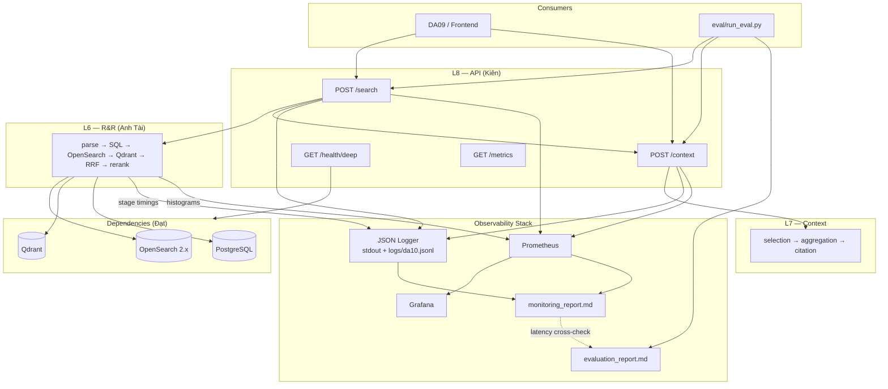

# monitoring_plan

# DA10 — Monitoring Plan

**Owner:** Vũ Đức Kiên (API & Evaluation)

**Phiên bản:** v1.0

**Phạm vi:** Quan sát **Search API**, **Context API**, dependencies (OpenSearch / Qdrant / Postgres) — Sprint 2 walking skeleton → Sprint 3 demo.

> Liên quan: [`docs/VuDucKien_evaluation_plan 3767d4db6a3d8089b5b1f4d12630d054.md`](VuDucKien_evaluation_plan%203767d4db6a3d8089b5b1f4d12630d054.md), [`docs/VuDucKien_api_schema_proposal.md`](VuDucKien_api_schema_proposal.md) (API contract chính thức), [`docs/slo_defination.md`](slo_defination.md), [`docs/10_observability.md`](10_observability.md), [`api/main.py`](../api/main.py)
> 

---

## 0. Mâu thuẫn đã biết & cách xử lý

| # | Mâu thuẫn | Cách xử lý trong plan này |
| --- | --- | --- |
| 1 | **SLO demo vs SLO Đạt:** PHANCONG / evaluation: p95 **< 500ms** (E2E, golden set tuần tự). `slo_defination.md`: server **≤150ms (95%)**, client **≤900ms @ 50 QPS** (BM25 load test). | **SLO chính Sprint 3 demo** = p95 < 500ms `/search` + `/context`. SLO Đạt → **Phụ lục A** (baseline BM25 + load). |
| 2 | **`evaluation_plan.md` §2:** per-stage latency ghi **TBD**. Bạn chốt monitoring **có per-stage**. | Monitoring plan **bắt buộc per-stage**; cập nhật evaluation plan khi Đạt + Anh Tài instrument xong. |
| 3 | **`api/main.py` hiện tại:** `GET /search` BM25-only, OpenSearch, metrics tên `search_bm25_*`. Plan target: `POST /search` + `POST /context` hybrid OpenSearch+Qdrant. | Sprint 2–3 **mở rộng** metrics (generic `da10_http_*`, stage histograms); giữ `search_bm25_*` trong Phụ lục A cho regression BM25. |
| 4 | **OpenSearch vs Elasticsearch:** Đã thống nhất team — stack chính thức = **OpenSearch 2.11.1**. | **Resolved.** Health check + metric labels dùng `opensearch`; xem `CHANGELOG_opensearch_unification.md`. |
| 5 | **Log full query** vs compliance PII (PHANCONG: kiểm soát PII reviews). | Demo Sprint 3: log full query theo yêu cầu team; ghi **retention 30 ngày**, không export log ra ngoài repo demo. Production DA09: review lại masking. |
| 6 | **Neo4j trong plan cũ:** evaluation/monitoring từng ghi Neo4j pre-filter. | **Resolved — OUT OF SCOPE.** Bỏ `neo4j_filter` stage, health probe Neo4j; pre-filter chỉ qua PostgreSQL. |

**Kết luận:** Các mâu thuẫn chính đã được resolve — còn lại **tách SLO demo vs appendix** và **nâng cấp instrumentation** từ Sprint 1 BM25 stub.

---

## 1. Mục tiêu

1. Theo dõi **SLO demo Sprint 3**: p95 latency < 500ms cho `/search` và `/context`.
2. Cung cấp **Prometheus metrics** + **Grafana dashboard** cho API và dependencies.
3. **Structured JSON logging** (file + stdout) hỗ trợ debug pipeline và tái lập (index version, commit).
4. **Deep health** (`/health/deep`) ping OpenSearch, Qdrant, Postgres.
5. **Per-stage latency** trong pipeline hybrid (parse → SQL pre-filter → OpenSearch → Qdrant → RRF → rerank → context).
6. Báo cáo định kỳ: `observability/reports/monitoring_report.md` (bổ sung cho `evaluation/reports/evaluation_report.md`).

---

## 2. Phạm vi

| Thành phần | In scope | Owner instrument |
| --- | --- | --- |
| `POST /search` | ✅ | Kiên (API) |
| `POST /context` | ✅ | Kiên (API) |
| `GET /health`, `GET /health/deep` | ✅ | Kiên |
| `GET /metrics` (Prometheus) | ✅ | Kiên |
| Per-stage pipeline metrics | ✅ | Anh Tài (R&R) + Kiên (wire vào API response/log) |
| OpenSearch / Qdrant / Postgres health | ✅ | Đạt (probes) + Kiên (aggregate `/health/deep`) |
| Grafana dashboards | ✅ | Kiên (dashboard JSON) |
| Alerting (Slack/PagerDuty) | TBD | — |
| Load test monitoring @ 50 QPS | Phụ lục A | Đạt |

**Consumer:** Team DA10 (dev/debug), mentor (demo), DA09 (tùy chọn đọc `monitoring_report.md`).

---

## 3. Kiến trúc Observability



**Phân vai observability:**

| Layer | Log | Metrics | Tracing |
| --- | --- | --- | --- |
| API (Kiên) | Request/response envelope, `request_id` | `da10_http_*` per endpoint | `request_id` (trace TBD OpenTelemetry) |
| R&R (Anh Tài) | Stage breakdown trong log | `da10_stage_*_seconds` | Gắn `request_id` |
| Index/Infra (Đạt) | Dependency errors | `da10_dependency_up`, probe latency | — |
| Eval (Kiên) | — | Client latency trong `evaluation_report.md` | — |

---

## 4. SLO & SLI — Sprint 3 Demo (chính thức)

Đồng bộ [`VuDucKien_evaluation_plan`](VuDucKien_evaluation_plan%203767d4db6a3d8089b5b1f4d12630d054.md) §6.3.

| SLI | SLO | Cách đo | Nguồn số liệu |
| --- | --- | --- | --- |
| Search latency p95 | **< 500 ms** | 50 golden queries × 3 runs, sequential, warmup 10 | `evaluation_report.md` (client httpx) + đối chiếu Prometheus |
| Context latency p95 | **< 500 ms** | Cùng protocol, sau mỗi search top-1 | `evaluation_report.md` + Prometheus |
| API availability | **≥ 99%** trong cửa sổ demo (pragmatic) | HTTP 2xx / tổng requests smoke + full eval | Prometheus `da10_http_requests_total` |
| Zero-result rate | **< 5%** | Search trả `results.length == 0` | Prometheus `da10_search_zero_results_total` / counter |
| Deep health | **All deps up** trước demo | `/health/deep` → all `status: ok` | Manual + Grafana panel |

> **Hai SLI latency:** (1) **Client-side** — golden set eval, SLO demo chính thức. (2) **Server-side** — Prometheus histogram tại API, dùng debug chênh lệch queue/network. Báo cáo **cả hai** trong `monitoring_report.md`.
> 

---

## 5. Phụ lục A — SLO Baseline BM25 (Đạt, Sprint 1)

Tham chiếu [`docs/slo_defination.md`](../docs/slo_defination.md). **Không thay** SLO demo hybrid 500ms; dùng để regression BM25-only và so sánh trước/sau async.

| SLI | SLO (BM25 baseline) | Metric hiện có (`api/main.py`) |
| --- | --- | --- |
| Availability | ≥ 99.9% / 30 ngày | `search_bm25_requests_total`, `search_bm25_errors_total` |
| Server latency | ≥ 95% requests ≤ **150 ms** | `search_bm25_request_duration_seconds_bucket{le="0.15"}` |
| Client latency @ 50 QPS | ≥ 95% ≤ **900 ms** | `scripts/benchmark_search.py` (load test) |

**Kế hoạch cải thiện** (từ `slo_defination.md` §3): async OpenSearch client, connection pool, cache — owner Đạt + Kiên (FastAPI `async def`).

---

## 6. Prometheus Metrics

### 6.1 Hiện có (Sprint 1 — giữ cho BM25 regression)

Từ [`api/main.py`](../api/main.py):

| Metric | Loại | Labels |
| --- | --- | --- |
| `search_bm25_request_duration_seconds` | Histogram | `endpoint` |
| `search_bm25_requests_total` | Counter | `endpoint` |
| `search_bm25_errors_total` | Counter | `endpoint` |

Scrape: `GET http://localhost:8000/metrics`

### 6.2 Mục tiêu Sprint 2–3 (thêm mới)

**HTTP (Kiên):**

| Metric | Loại | Labels |
| --- | --- | --- |
| `da10_http_requests_total` | Counter | `endpoint`, `method`, `status` |
| `da10_http_request_duration_seconds` | Histogram | `endpoint` |
| `da10_search_zero_results_total` | Counter | `search_mode` |
| `da10_context_build_duration_seconds` | Histogram | — |

**Per-stage (Anh Tài → expose cho API log + Prometheus):**

| Metric | Loại | Mô tả |
| --- | --- | --- |
| `da10_stage_duration_seconds` | Histogram | `stage`: `parse`, `sql_filter`, `os_bm25`, `qdrant_vector`, `rrf`, `rerank`, `context_select`, `context_aggregate`, `citation_build` |

**Dependencies (Đạt):**

| Metric | Loại | Labels |
| --- | --- | --- |
| `da10_dependency_up` | Gauge | `dependency`: `opensearch`, `qdrant`, `postgres` |
| `da10_dependency_probe_duration_seconds` | Histogram | `dependency` |

**Info labels (log + optional metric const label):**

`index_opensearch`, `index_qdrant`, `embedding_model`, `git_commit` — ghi trong JSON log mỗi request; Grafana variables từ env tại deploy time.

### 6.3 Histogram buckets (đề xuất)

```
da10_http_request_duration_seconds: 0.05, 0.1, 0.15, 0.25, 0.5, 0.75, 1.0, 2.0, 5.0
da10_stage_duration_seconds:        0.01, 0.025, 0.05, 0.1, 0.25, 0.5, 1.0
```

---

## 7. Structured JSON Logging

### 7.1 Cấu hình

| Thuộc tính | Giá trị |
| --- | --- |
| Format | **JSON** (một object / dòng) |
| Output | **stdout** + file `logs/da10.jsonl` |
| Full query | **Có** — field `query` plain text (Sprint 3 demo) |
| Correlation | `request_id` (UUID) xuyên suốt search → context |

### 7.2 Schema log — `POST /search`

```json
{
  "timestamp": "2026-06-04T10:00:00+07:00",
  "level": "INFO",
  "event": "search_completed",
  "request_id": "uuid",
  "endpoint": "/search",
  "query": "Tôi muốn resort yên tĩnh gần biển cho gia đình",
  "top_k": 10,
  "search_mode": "full_hybrid",
  "results_count": 5,
  "zero_results": false,
  "took_ms": 320,
  "stages_ms": {
    "parse": 45,
    "sql_filter": 12,
    "os_bm25": 80,
    "qdrant_vector": 95,
    "rrf": 5,
    "rerank": 65
  },
  "index_opensearch": "idx_hotel_chunks_v1.0",
  "index_qdrant": "col_documents_v1.0",
  "git_commit": "abc1234",
  "status": 200
}
```

### 7.3 Schema log — `POST /context`

```json
{
  "timestamp": "2026-06-04T10:00:01+07:00",
  "level": "INFO",
  "event": "context_completed",
  "request_id": "uuid",
  "endpoint": "/context",
  "hotel_id": 805030,
  "query": "Tôi muốn resort yên tĩnh gần biển cho gia đình",
  "chunk_count": 3,
  "citation_count": 2,
  "token_count": 412,
  "took_ms": 180,
  "stages_ms": {
    "context_select": 20,
    "context_aggregate": 90,
    "citation_build": 70
  },
  "status": 200
}
```

### 7.4 Log lỗi

```json
{
  "level": "ERROR",
  "event": "search_failed",
  "request_id": "uuid",
  "error_type": "DependencyUnavailable",
  "dependency": "qdrant",
  "message": "...",
  "status": 503
}
```

**Retention:** 30 ngày local; rotate file theo ngày (`da10-2026-06-04.jsonl`).

**Implementation:** `observability/logging/` — Python `logging` + `python-json-logger` hoặc `structlog`.

---

## 8. Health Checks

### 8.1 `GET /health` (shallow)

```json
{ "status": "ok" }
```

Chỉ API process alive — dùng Docker/K8s liveness.

### 8.2 `GET /health/deep` (bắt buộc trước demo)

```json
{
  "status": "ok",
  "checks": {
    "opensearch": { "status": "ok", "latency_ms": 12 },
    "qdrant": { "status": "ok", "latency_ms": 8 },
    "postgres": { "status": "ok", "latency_ms": 5 }
  },
  "index_opensearch": "idx_hotel_chunks_v1.0",
  "index_qdrant": "col_documents_v1.0"
}
```

- `status` tổng = `ok` chỉ khi **tất cả** dependencies `ok`.
- HTTP **503** nếu bất kỳ dependency fail.
- Cập nhật `da10_dependency_up` gauge sau mỗi probe.

**Owner probes:** Đạt (connection config); **Owner endpoint:** Kiên.

---

## 9. Grafana

### 9.1 Setup (local demo)

```
docker compose:
  - prometheus (scrape api:8000/metrics)
  - grafana (dashboards provisioning)
```

File đích: `observability/grafana/dashboards/da10_api.json`

### 9.2 Dashboard panels (tối thiểu)

| Panel | Query / nguồn |
| --- | --- |
| Search p95 latency | `histogram_quantile(0.95, da10_http_request_duration_seconds{endpoint="/search"})` |
| Context p95 latency | `histogram_quantile(0.95, ...{endpoint="/context"})` |
| Request rate | `rate(da10_http_requests_total[5m])` |
| Error rate | `rate(da10_http_requests_total{status=~"5.."}[5m])` |
| Zero-result rate | `rate(da10_search_zero_results_total[5m])` |
| Stage breakdown | Heatmap / bar `da10_stage_duration_seconds` |
| Dependency up | `da10_dependency_up` stat panels |
| BM25 appendix | Panel riêng `search_bm25_request_duration_seconds` |

### 9.3 Biến dashboard

`index_opensearch`, `index_qdrant`, `search_mode` — từ Prometheus external labels hoặc text annotation trong report.

---

## 10. Prometheus Scrape Config (mẫu)

```yaml
# observability/prometheus/prometheus.yml
scrape_configs:
-job_name: da10-api
scrape_interval: 15s
static_configs:
-targets:["host.docker.internal:8000"]
metrics_path: /metrics
```

---

## 11. Quy trình vận hành

| Sự kiện | Hành động | Output |
| --- | --- | --- |
| Mỗi PR | Smoke 5 query + xem error log | CI log / manual |
| Sprint 2 cuối | Full eval + snapshot Grafana | `evaluation_report.md` + `monitoring_report.md` draft |
| Trước demo Sprint 3 | `/health/deep` + full eval + export dashboard PNG | `monitoring_report.md` final |
| Sau đổi index/data | Re-tag version, chạy lại deep health + eval | Header version trong cả 2 report |

### 11.1 `monitoring_report.md` vs `evaluation_report.md`

| File | Nội dung chính | Owner |
| --- | --- | --- |
| [`evaluation/reports/evaluation_report.md`](../evaluation/reports/evaluation_report.md) | Recall@10, MRR, NDCG, chunk metrics, human rubric, **client p95** | Kiên |
| `observability/reports/monitoring_report.md` | SLO compliance, Prometheus p95, error/zero-result rate, stage breakdown, dependency uptime, Grafana snapshot | Kiên |

**Cross-check:** Nếu client p95 (eval) và server p95 (Prometheus) chênh > 2× → ghi nhận trong `monitoring_report.md` (queue/network/thread pool).

### 11.2 Mẫu header `monitoring_report.md`

```markdown
# Monitoring Report — mon_2026-06-04_001

| Field | Value |
|-------|-------|
| git_commit | abc1234 |
| index_opensearch | idx_hotel_chunks_v1.0 |
| index_qdrant | col_documents_v1.0 |
| eval_run_id | eval_2026-06-04_001 |

## SLO Demo (target < 500ms p95)

| Endpoint | Client p95 (eval) | Server p95 (Prometheus) | Pass |
|----------|-------------------|-------------------------|------|
| /search | | | |
| /context | | | |

## Reliability

| Metric | Value | Target |
|--------|-------|--------|
| Error rate | | < 1% |
| Zero-result rate | | < 5% |
| Deep health | | all ok |

## Stage Latency (server p95)

| Stage | p95 ms |
|-------|--------|
| parse | |
| os_bm25 | |
| qdrant_vector | |
| rerank | |
| context_build | |

## Appendix A — BM25 Baseline (slo_defination.md)

| SLI | Value | SLO |
|-----|-------|-----|
| Server ≤150ms (95%) | | ≥95% |
| Client ≤900ms @50 QPS | | ≥95% |
```

---

## 12. RACI

| Việc | R | A | C | I |
| --- | --- | --- | --- | --- |
| monitoring_plan.md | Kiên | Kiên | Đạt, Anh Tài | Team |
| Prometheus `/metrics` API | Kiên | Kiên | Đạt | Team |
| Per-stage instrumentation | Anh Tài | Anh Tài | Kiên | Đạt |
| Dependency probes | Đạt | Đạt | Kiên | Team |
| Grafana dashboards | Kiên | Kiên | Đạt | Team |
| JSON logging middleware | Kiên | Kiên | — | Team |
| `monitoring_report.md` | Kiên | Kiên | Đạt | Mentor |
| BM25 appendix SLO | Đạt | Đạt | Kiên | Team |
| Alerting | TBD | TBD | — | Team |

---

## 13. Lịch triển khai

| Sprint | Deliverable |
| --- | --- |
| Sprint 1 | Plan (file này); metrics BM25 có sẵn trong `api/main.py` |
| Sprint 2 Tuần 2 | `da10_http_*` + JSON logging + `/health/deep` skeleton |
| Sprint 2 cuối | Per-stage histograms; Grafana dashboard v0; `monitoring_report.md` draft |
| Sprint 3 | Full observability trước demo; alert rules TBD nếu kịp |

---

## 14. Dependencies & công nghệ

| Mục đích | Công nghệ |
| --- | --- |
| Metrics exposition | `prometheus_client` (đã dùng trong `api/main.py`) |
| Metrics storage | **Prometheus** |
| Visualization | **Grafana** |
| JSON logs | `python-json-logger` hoặc `structlog` |
| Log files | `logs/*.jsonl` |
| Health probes | `httpx` / native clients (OpenSearch, Qdrant, asyncpg) |
| Tracing (future) | OpenTelemetry — **TBD** |
| Alerting | **TBD** |

**Đề xuất thêm vào `requirements.txt` / `observability/requirements-obs.txt`:**

```
prometheus_client>=0.20
python-json-logger>=2.0
structlog>=24.0
httpx>=0.27
```

---

## 15. TBD

- [ ]  Alerting rules + channel (Slack/email)
- [ ]  OpenTelemetry `trace_id` thay cho chỉ `request_id`
- [ ]  CI scrape Prometheus trên PR
- [ ]  Log masking policy khi tích hợp DA09 production